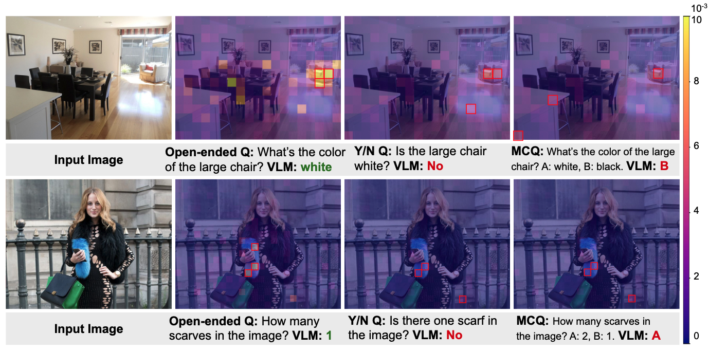

# Tinted Frames: Question Framing Blinds Vision-Language Models

<p align="center">
  <a href="https://arxiv.org/abs/2603.19203"></a>
  <a href="https://davidhalladay.github.io/tinted_frames_demo/"></a>
  <a href="https://www.alphaxiv.org/overview/2603.19203"></a>
</p>

<p align="center">
  <strong>Wan-Cyuan Fan<sup>1,2</sup> &nbsp; Jiayun Luo<sup>1,2†</sup> &nbsp; Declan Kutscher<sup>3†</sup> &nbsp; Leonid Sigal<sup>1,2</sup> &nbsp; Ritwik Gupta<sup>3</sup></strong>
</p>
<p align="center">
  <sup>1</sup>University of British Columbia &nbsp;&nbsp;
  <sup>2</sup>Vector Institute for AI &nbsp;&nbsp;
  <sup>3</sup>UC Berkeley
</p>
<p align="center">
  <sup>†</sup>Equal contribution
</p>

<p align="center">
  
</p>

**TL;DR:** VLMs are selectively blind — they decide how much to look at an image based on question framing (open-ended vs Yes/No vs MCQ), even when the same visual reasoning is required. We analyze this phenomenon and mitigate it in this paper.

---

<p align="center">
  
</p>

<p align="center">
  <em><strong>Figure 1.</strong> VLM grounding changes as a function of question framing. Attention rollouts reveal that while the model actively attends to the target object during open-ended generation, it exhibits disengagement and misallocation when the same question is posed as a Yes/No or MCQ task. The top 3 tokens with the highest attention are highlighted in red boxes, and the minimum and maximum values of the linear colormap are set to the same value for all images.</em>
</p>

---

## News

- **[2026-04]** Initial release of code, checkpoints, and code for dataset setup.

---

## Environment Setup

**Requirements:** Python 3.10+, PyTorch 2.1+, CUDA-capable GPU.

```bash
git clone https://github.com/davidhalladay/Tinted-Frames.git
cd Tinted-Frames
pip install -r requirements.txt
```

---

## Data Setup

### Evaluation & Analysis Benchmarks

Datasets and benchmarks can be downloaded automatically by running:

```bash
bash scripts/download_data.sh
```

This will set up the following datasets under `data/`:

```
data/
├── gqa/
│   ├── images/
│   ├── data/
│   └── val_sceneGraphs.json
├── vstar_bench/
│   ├── test_questions.jsonl
│   ├── direct_attributes/
│   ├── relative_position/
│   └── ...
├── pope/
│   ├── val2014/
│   ├── coco/
│   │   ├── coco_pope_adversarial.json
│   │   ├── coco_pope_popular.json
│   │   └── coco_pope_random.json
│   └── llava_pope_test.jsonl
├── MME/
├── HallusionBench/
├── hrbench/
├── mmmu_pro/
├── realworldqa/
└── seed_bench/
    ├── SEED-Bench.json
    └── SEED-Bench-image/
...
```

### LLaVA Training Data (for prompt-tuning)

For the training, we use the LLaVA-1.5 instruction-tuning mix (`llava_v1_5_mix665k`). Please follow the official data preparation guide:

**[TinyLLaVA Factory — Prepare Datasets](https://tinyllava-factory.readthedocs.io/en/latest/Prepare%20Datasets.html)**

Place the data under `data/llava_train/` with the following structure:

```
data/llava_train/
├── text_files/
│   └── llava_v1_5_mix665k.json
├── coco/
├── gqa/
├── share_textvqa/
├── textvqa/
├── vg/
└── ...
```

---

## Model Checkpoint

The fine-tuned prompt-tuning checkpoint (Qwen2.5-VL-7B) is provided directly in this repository under `checkpoints/qwen25vl7b/`. No additional download is needed.

---

## Evaluation

Run evaluation for both the baseline and our fine-tuned model:

```bash
bash scripts/run_evaluation.sh
```

Results are aggregated into a CSV file at `checkpoints/evaluation/`.

---

## Training

Train learnable prompt tokens:

```bash
bash scripts/run_training.sh
```

> **Note:** We provide a set of pre-reframed training questions (generated by Qwen3-30B) at `data/question_mapper.json`. Training with up to 8k samples (`SAMPLE_N <= 8000`) will automatically load from this cache and **does not require an API key**. For larger sample counts, LLM-based reframing will be triggered on the fly and an OpenAI API key must be provided:
> ```bash
> export OPENAI_API_KEY=your_key_here
> ```

---

## Analysis

### Cross-Framing Inconsistency

> **Note:** This analysis uses an LLM to reframe questions across formats. An OpenAI API key is required:
> ```bash
> export OPENAI_API_KEY=your_key_here
> ```

```bash
bash scripts/run_inconsistency.sh gqa
# or
bash scripts/run_inconsistency.sh seedbench
```

Results are saved to `outputs/inconsistency/`.

### Framing Attention Analysis

How framing changes visual attention patterns (attention mass, spatial distribution) across GQA and V\* Bench:

```bash
bash scripts/run_attention_analysis.sh
```

Results (plots, JSON summaries) are saved to `outputs/attention_analysis/`.

---

## Citation

```bibtex
@article{fan2026tinted,
  title={Tinted Frames: Question Framing Blinds Vision-Language Models},
  author={Fan, Wan-Cyuan and Luo, Jiayun and Kutscher, Declan and Sigal, Leonid and Gupta, Ritwik},
  journal={arXiv preprint arXiv:2603.19203},
  year={2026}
}
```

---

## Acknowledgements

This work was funded, in part, by the Vector Institute for AI, Canada CIFAR AI Chairs, NSERC Canada Research Chair (CRC), AML-TN UBC, and NSERC Discovery and Discovery Accelerator Supplement Grants. Resources used in preparing this research were provided, in part, by the Province of Ontario, the Government of Canada through CIFAR, the Digital Research Alliance of Canada ([alliancecan.ca](https://alliancecan.ca)), companies sponsoring the Vector Institute, and Advanced Research Computing at the University of British Columbia. Additional hardware support was provided by John R. Evans Leaders Fund CFI grant and Compute Canada under the Resource Allocation Competition award. Ritwik Gupta and Declan Kutscher were supported in part by funding from the Department of Defense, The House Fund, and BAIR's industrial alliance programs. Additional compute was provided by the Department of Defense's High Performance Computing Modernization Program. We are immensely grateful to Bicheng Xu from UBC and Stephanie Fu from UCB for sharing their valuable suggestions in paper writing and experiments.

---

## License

This project is released for academic research purposes.
